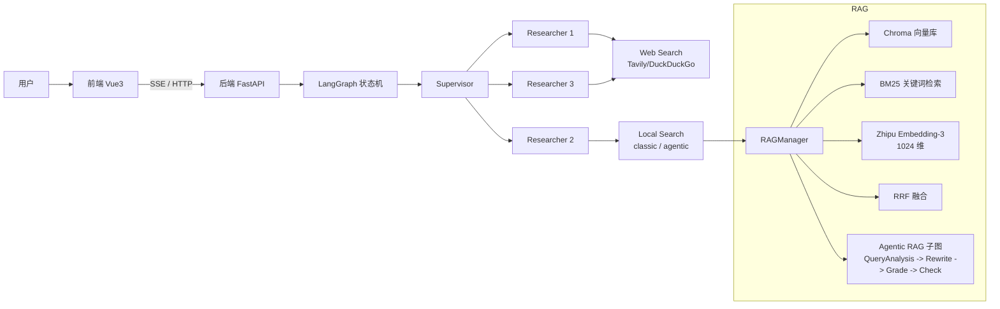
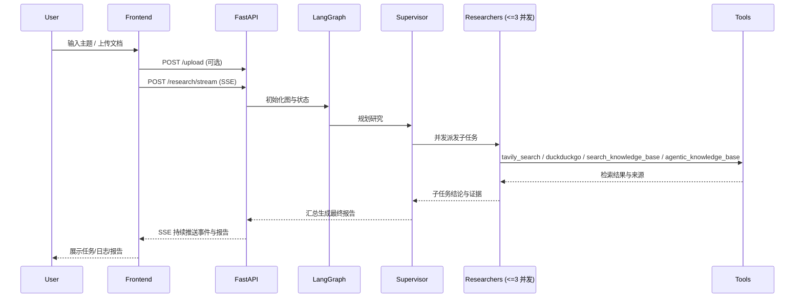

# easy_deepresearch

easy_deepresearch 是一个基于 LangGraph 的多智能体深度研究系统：能够拆解复杂问题、并发检索互联网与本地知识库，并输出结构化、有引用的研究报告。当前项目已同时支持 **经典 Hybrid RAG** 与 **Agentic RAG**，使本地知识检索从静态流水线升级为具备查询分析、重写、文档评分、重试回退和幻觉检测能力的子图流程。

更完整的技术文档见 [TECHNICAL_DOCUMENTATION.md](file:///d:/LLMLearning/open_deep_research-main/easy_deepresearch/docs/TECHNICAL_DOCUMENTATION.md)，Agentic RAG 专项说明见 [Agentic-RAG-report.md](file:///d:/LLMLearning/open_deep_research-main/easy_deepresearch/docs/Agentic-RAG-report.md)。

## 架构概览



## 执行流程



## 核心特性

- 自主规划 + 并发研究：Supervisor 拆解任务，Researcher 并发执行（默认上限 3）
- 实时可视化：SSE 推送事件流，前端展示任务卡片、日志与最终报告
- 经典 Hybrid RAG（本地知识库增强）
  - 父子块索引：小块检索（更准召回），大块生成（上下文更完整）
  - 双路检索：语义向量检索 + BM25 关键词检索
  - RRF 融合：综合两路排名，避免过度依赖单一检索方式
- Agentic RAG（智能体化知识检索）
  - 预检索：Query Analysis / Query Rewriting / Query Decomposition
  - 检索中：Document Grader + Reflect / Retry / Knowledge Gap
  - 后检索：GenerateDraft + Hallucination Check
  - 回退路径：本地库证据不足时触发公网搜索，后续可扩展到 MCP 动态知识注入

## RAG 设计说明

- 经典 Hybrid RAG
  - 父子块索引（小块检索，大块生成）
  - 子块入库：chunk_size≈800，overlap≈160（用于细粒度召回）
  - 父块生成：chunk_size≈3000，overlap≈300（用于最终生成上下文）
  - 双路检索 + RRF
    - Dense：Chroma + Zhipu Embedding-3（1024 维）
    - Keyword：BM25Retriever（langchain-community）
    - Fuse：RRF（rrf_k=60）
- Agentic RAG
  - 查询分析：判断直接检索、先重写还是先拆解
  - 查询拆解：复杂问题拆为 2-3 个子查询并发召回
  - 文档评分：对 Parent Chunk 做 Relevant / Irrelevant 判定
  - 自纠错：低相关结果会触发 rewrite + retry，避免直接幻觉生成
  - 幻觉检测：生成草稿后执行 groundedness 检查，不通过则重试或回退
  - 外部补充：本地知识持续不足时触发 Web fallback，并为 MCP 动态注入预留接口
- 代码入口
  - 管理器实现：[rag_manager.py](file:///d:/LLMLearning/open_deep_research-main/easy_deepresearch/backend/src/core/rag_manager.py)
  - 工具注册：[utils.py](file:///d:/LLMLearning/open_deep_research-main/easy_deepresearch/backend/src/core/utils.py)
  - Skill 注册：[builtin.py](file:///d:/LLMLearning/open_deep_research-main/easy_deepresearch/backend/src/core/skills/builtin.py)

## Skill 体系与 MCP 集成

本项目不仅是一个静态的 Agent，更是一个可扩展的智能体平台。

### Skill System
- **动态注册**: 所有工具（包括搜索、经典 RAG、Agentic RAG、arXiv）均封装为 `Skill` 对象，通过 `SkillRegistry` 统一管理。
- **可插拔**: 开发者可以轻松编写新的 Python Skill 并注册，Agent 会自动发现并根据语义选择使用。
- **能力分层**: `search_knowledge_base` 保留为底层经典检索原语，`agentic_knowledge_base` 作为带子图编排的增强能力。
- **运行模式切换**: 通过 `agentic_rag_mode` 支持 classic / agentic / both 三种模式。

### Model Context Protocol (MCP)
本项目完整实现了 MCP 协议的双向集成，体现了对前沿 AI 生态的拥抱：

1. **作为 MCP Client (消费能力)**:
   - 能够连接外部 MCP Server（如文件系统、GitHub、数据库）。
   - 自动将远程 MCP Tool 映射为本地 Skill，让 Agent 获得操作真实世界的能力。
   - *示例*: `src/core/skills/mcp_client.py` 展示了如何通过 stdio 连接本地 MCP 服务。

2. **作为 MCP Server (供给能力)**:
   - 将自身的“深度研究”与“知识库检索”能力暴露为标准 MCP 工具。
   - 其他 AI 助手（如 Claude Desktop、Cursor）可以连接本服务，直接调用 `start_deep_research` 进行研究。
   - 当前 MCP 服务端默认仍以经典知识库检索接口为主，Agentic RAG 主要通过后端内部 Skill / Tool 体系提供。
   - *入口*: `backend/mcp_server.py`

### 核心代码
- 技能基类: [base.py](file:///d:/LLMLearning/open_deep_research-main/easy_deepresearch/backend/src/core/skills/base.py)
- MCP 客户端适配: [mcp_client.py](file:///d:/LLMLearning/open_deep_research-main/easy_deepresearch/backend/src/core/skills/mcp_client.py)
- MCP 服务端入口: [mcp_server.py](file:///d:/LLMLearning/open_deep_research-main/easy_deepresearch/backend/mcp_server.py)

## API 接口

- POST /research/stream：以 SSE 推送研究过程与最终报告（见 [main.py](file:///d:/LLMLearning/open_deep_research-main/easy_deepresearch/backend/main.py)）
- POST /upload：上传 PDF/TXT/MD 文档并摄入知识库（见 [main.py](file:///d:/LLMLearning/open_deep_research-main/easy_deepresearch/backend/main.py)）
- GET /skills：返回当前已注册技能（含 `agentic_knowledge_base`）
- POST /skills/{name}/toggle：技能开关接口（当前为 mock 语义，占位供后续前端配置扩展）

## 评估系统

- 在线评估埋点：
  - 请求可携带 `run_id`、`experiment_id`、`dataset_id`、`sample_id`、`eval_mode`、`evaluation_enabled`
  - 当 `evaluation_enabled=true` 时，系统会在后端写入结构化评估事件（默认 `backend/data/evaluations/evaluation_events.jsonl`）
- 离线基准回放：
  - 入口：[runner.py](file:///d:/LLMLearning/open_deep_research-main/easy_deepresearch/backend/src/evaluation/runner.py)
  - 示例数据集：[baseline_eval_samples.jsonl](file:///d:/LLMLearning/open_deep_research-main/easy_deepresearch/backend/data/eval_datasets/baseline_eval_samples.jsonl)
  - 典型命令：

```bash
cd backend
python -m src.evaluation.runner --dataset data/eval_datasets/baseline_eval_samples.jsonl --mode agentic --experiment-id exp-agentic-v1
```

- 评估报告聚合：
  - 入口：[report.py](file:///d:/LLMLearning/open_deep_research-main/easy_deepresearch/backend/src/evaluation/report.py)
  - 输出 classic / agentic / both 对比指标与差值，直接回答“哪个好、好多少”

## 配置与环境

- 并发：max_concurrent_research_units（默认 3），见 [configuration.py](file:///d:/LLMLearning/open_deep_research-main/easy_deepresearch/backend/src/core/configuration.py)
- RAG 模式：`agentic_rag_mode`（`both` / `classic` / `agentic`）
- 评估开关：请求级 `evaluation_enabled`（默认关闭）
- 环境变量（backend/.env）
  - OPENAI_API_KEY / OPENAI_BASE_URL（用于 OpenAI 兼容端点，例如智谱）
  - TAVILY_API_KEY（Web 检索）
  - AGENTIC_RAG_MODEL / AGENTIC_RAG_MODEL_MAX_TOKENS（可选，用于 Agentic RAG 子图中的分析、评分、幻觉检测节点）
  - EVALUATION_EVENTS_FILE（可选，自定义评估事件落盘路径）

## 快速开始

### 后端启动

```bash
cd backend

# 推荐：基于 pyproject.toml 安装依赖
pip install .

# 启动服务
python main.py
```

### 前端启动

```bash
cd frontend
npm install
npm run dev
```

## 使用指南

- 在首页输入研究主题
- 在输入区即可上传知识库文档（可选）
- 启动研究后观察任务进度、日志与报告输出

## 目录结构

```
easy_deepresearch/
├── backend/
│   ├── main.py
│   ├── service.py
│   ├── src/core/
│   │   ├── deep_researcher.py
│   │   ├── rag_manager.py
│   │   ├── utils.py
│   │   ├── state.py
│   │   ├── prompts.py
│   │   ├── skills/
│   │   │   ├── base.py
│   │   │   ├── builtin.py
│   │   │   └── mcp_client.py
│   │   └── ...
├── frontend/
│   ├── src/components/
│   │   ├── ResearchForm.vue
│   │   ├── TaskList.vue
│   │   └── ...
│   ├── src/composables/
│   │   └── useResearch.ts
│   └── App.vue
└── docs/
    ├── TECHNICAL_DOCUMENTATION.md
    └── Agentic-RAG-report.md
```

## 许可证

MIT License
