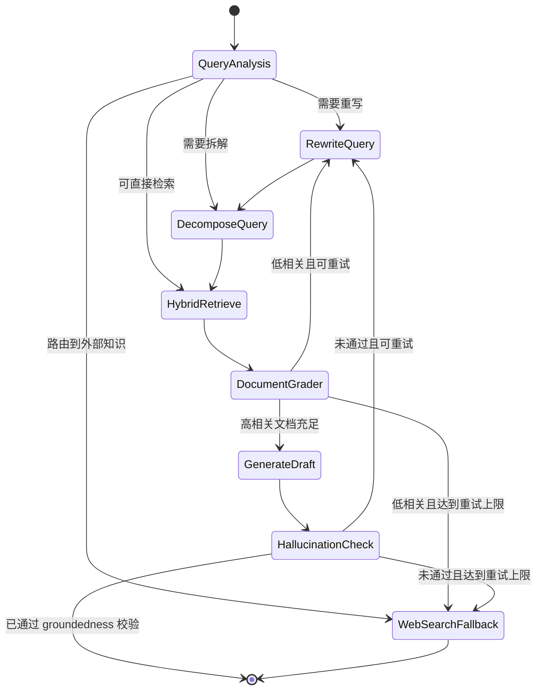

# Agentic RAG 模块实现报告

## 1. 背景与目标

原始版本的本地知识检索链路，本质上是一个典型的 Pipeline：

1. 接收 query
2. 执行 Dense + BM25 检索
3. 通过 RRF 融合结果
4. 直接将召回内容交给上层生成逻辑

这种模式简单高效，但在深度研究场景中存在明显短板：

- 查询表达不佳时，召回质量不可控
- 一次检索失败后缺乏自我修正能力
- 无法判断召回文档是否真正相关
- 容易基于弱相关证据生成带幻觉的答案
- 面对知识缺口时无法主动切换外部知识源

因此，本次改造的核心目标是：把传统 RAG 升级为 **Agentic RAG**，让本地知识检索从“被动工具”变成“具备感知、决策、纠错和回退能力的知识子代理”。

## 2. 设计原则

Agentic RAG 的设计遵循以下原则：

- **保留经典能力**：不推翻原有 `Dense + BM25 + RRF` 检索主干
- **引入智能控制层**：在检索前、中、后加入可决策节点
- **最小侵入接入现有系统**：以 Tool / Skill 形式接入，不破坏主图
- **可回退**：新能力失败时可回落到经典 RAG
- **可扩展**：为 Web fallback、MCP 动态知识注入、多跳追问保留接口

## 3. 模块边界

本次 Agentic RAG 改造主要落在以下文件：

- `backend/src/core/state.py`
- `backend/src/core/prompts.py`
- `backend/src/core/rag_manager.py`
- `backend/src/core/utils.py`
- `backend/src/core/skills/builtin.py`
- `backend/src/core/configuration.py`

它并没有替换主研究图，而是作为 **Researcher 可调用的新型本地知识工具** 被接入现有系统。

## 4. 整体执行流程

### 4.1 逻辑流程图

### 4.2 三阶段结构

#### 预检索阶段

- Query Analysis
- Query Rewriting
- Query Decomposition

#### 检索中阶段

- Hybrid Retrieve
- Document Grader
- Reflect / Retry
- Knowledge Gap

#### 后检索阶段

- Generate Draft
- Hallucination Check
- Web Search Fallback

## 5. 具体实现细节

### 5.1 状态定义

为了让子图具备稳定、可路由的中间状态，本次新增了多组结构化模型。

#### 结构化输出模型

新增：

- `QueryAnalysisResult`
- `QueryRewriteResult`
- `QueryDecompositionResult`
- `DocumentGradeResult`
- `HallucinationCheckResult`

这些模型的作用是把各节点输出变成可编程字段，例如：

- `route`
- `needs_rewrite`
- `needs_decomposition`
- `relevant`
- `grounded`

这使后续的路由逻辑不再依赖自然语言关键词匹配，而是能够直接依据布尔值和枚举值做条件跳转。

#### 子图状态

新增 `AgenticRAGState`，包含：

- `query`
- `rewritten_query`
- `sub_queries`
- `retrieval_queries`
- `retrieved_docs`
- `graded_docs`
- `retry_count`
- `max_retries`
- `knowledge_gap`
- `draft_answer`
- `final_answer`
- `route`
- `trace`

其中：

- `retry_count` 用于熔断，防止死循环
- `knowledge_gap` 表示本地知识库是否已无法支撑问题
- `trace` 用于输出子图执行路径，方便调试与可观测性

### 5.2 Prompt 设计

Agentic RAG 新增了 5 组 Prompt：

#### 1. Query Analysis Prompt

职责：

- 判断问题是更适合本地知识库还是外部搜索
- 判断是否需要重写
- 判断是否需要拆解

输出字段：

- `route`
- `needs_rewrite`
- `needs_decomposition`
- `rationale`

#### 2. Query Rewrite Prompt

职责：

- 将模糊 query 改写成更适合 Dense + BM25 的检索表达
- 补足关键实体、语义上下文和检索关键词

#### 3. Query Decomposition Prompt

职责：

- 将复杂问题拆解为 2-3 个互补、非重叠的子问题
- 使系统能进行并发检索

#### 4. Document Grader Prompt

职责：

- 对召回文档做 Relevant / Irrelevant 判定
- 为自我纠错提供质量依据

#### 5. Hallucination Check Prompt

职责：

- 对草稿和证据进行 groundedness 校验
- 确保主要事实都能在证据中找到支撑

### 5.3 RAGManager 的升级

RAGManager 不再只是“索引 + 检索”模块，而是承担了两层职责。

#### 第一层：经典检索原语

保留了：

- 文档摄入 `ingest_file`
- BM25 重建 `_rebuild_bm25_from_corpus`
- 经典融合 `_rrf_fuse`
- 传统 `retrieve`

新增：

- `retrieve_with_scores`
  - 不仅返回文档，还返回融合后分数
  - 为后续 Agentic 节点保留更多检索上下文

#### 第二层：Agentic 节点执行器

新增以下内部方法：

- `_analyze_query`
- `_rewrite_query`
- `_decompose_query`
- `_grade_document`
- `_check_hallucination`

这些方法统一调用轻量模型，带结构化输出，并在异常时提供 fallback heuristic。

例如：

- Query Analysis 失败时，用关键词启发式做路由判断
- Document Grader 失败时，退化为简单 lexical overlap
- Hallucination Check 失败时，退化为非空检查

这样设计的目的，是让 Agentic RAG 在没有理想模型响应时仍能继续运行，而不是整条链路崩掉。

### 5.4 子图实现

核心方法是 `run_agentic_rag(...)`。

它会在运行时临时构造一个 `StateGraph`，并注册以下节点：

- `query_analysis`
- `rewrite_query`
- `decompose_query`
- `hybrid_retrieve`
- `document_grader`
- `generate_draft`
- `hallucination_check`
- `web_search_fallback`

#### QueryAnalysis

负责决定：

- 是否本地检索
- 是否需要重写
- 是否需要拆解
- 是否直接走外部搜索

#### RewriteQuery

对当前 query 做检索友好化改写。

#### DecomposeQuery

把复杂问题拆成多个子查询，并将这些子查询写入 `retrieval_queries`。

#### HybridRetrieve

对每个子查询执行：

- Dense retrieval
- BM25 retrieval
- RRF 融合
- Parent Chunk 聚合

再把所有子查询的结果池合并去重。

#### DocumentGrader

对召回的文档做相关性过滤，并计算通过比例。

如果通过比例低于阈值：

- 且未到重试上限：回到 `rewrite_query`
- 已到上限：进入 `web_search_fallback`

#### GenerateDraft

把通过筛选的 Parent Chunk 组装成证据摘要型草稿。

当前实现偏工程化摘要：

- 标明原问题
- 列出证据片段与来源
- 输出一版简洁结论

#### HallucinationCheck

判断当前草稿是否有证据支撑。

如果未通过：

- 可重试：回到 `rewrite_query`
- 不可重试：进入 fallback

#### WebSearchFallback

如果本地知识库确实无法支撑问题：

- 输出知识缺口说明
- 调用外部搜索补充结果
- 将最终输出与 trace 一并返回

### 5.5 熔断与防死循环

Agentic RAG 天然存在重写 -> 检索 -> 评分 -> 再重写的循环风险。

为避免死循环，当前实现采用：

- `max_retries`
- `retry_count`

机制：

- 每次因评分不达标或 groundedness 不达标触发回退时，`retry_count + 1`
- 到达上限后，强制跳到 `web_search_fallback`

这使得子图既有自我纠错能力，也能在错误路径上及时熔断。

## 6. Tool / Skill 集成方式

### 6.1 新增 Tool

新增工具：

- `agentic_knowledge_base`

该工具由 `utils.py` 暴露，职责是：

- 调用 `RAGManager.run_agentic_rag`
- 为 fallback 提供 Tavily Web Search 补充能力
- 返回最终答案、知识缺口标记与执行轨迹
- 在失败时回落到经典 `search_knowledge_base`

### 6.2 新增 Skill

在 `builtin.py` 中新增：

- `AgenticRAGSearchSkill`

其作用是将 `agentic_knowledge_base` 映射为统一 Skill。

这样 Researcher 在工具调用时可以把它当成常规工具一样使用，而不需要知道它内部其实是一个 LangGraph 子图。

### 6.3 模式切换

新增配置项：

- `agentic_rag_mode`

支持：

- `both`
- `classic`
- `agentic`

对应行为：

- `both`：同时暴露经典 RAG 和 Agentic RAG
- `classic`：只暴露 `search_knowledge_base`
- `agentic`：只暴露 `agentic_knowledge_base`

该模式在工具装配时生效，使系统可以平滑 A/B 测试和灰度切换。

## 7. MCP 动态知识注入设计

本次实现并未直接把 MCP 数据流自动接进 Agentic RAG，但已经完成关键前置能力：

- `ingest_external_documents(...)`

它允许系统在运行时接收外部文档数组：

- 字符串列表
- 或包含 `content/source/metadata` 的结构化对象

这些数据会：

1. 被切分为 child chunk
2. 写入 Chroma
3. 写入 BM25 语料
4. 参与当前后续检索

这意味着下一步只需要把外部 MCP Tool 拉到的数据映射成 `external_documents`，就能完成“动态注入 -> 临时索引 -> 继续推理”的闭环。

## 8. 当前版本的能力边界

虽然 Agentic RAG 已经完成了主要闭环，但目前仍有一些现实边界：

### 已完成

- Query Analysis
- Query Rewrite
- Query Decomposition
- Hybrid Retrieve
- Document Grader
- Retry / Fallback
- Hallucination Check
- 工具与 Skill 接入
- 模式切换
- MCP 动态文档摄入接口预留

### 尚未完全展开

- 真正意义上的多跳二次追问闭环
- claim 级别而不是整段级别的 groundedness 校验
- Agentic RAG 对外作为独立 MCP Tool 暴露
- Skill 开关接口与前端配置的完整联动

## 9. 与主研究图的关系

Agentic RAG 并没有替代主研究图，而是以“本地知识增强工具”的身份嵌入：

- Supervisor 仍负责任务拆解
- Researcher 仍负责具体研究执行
- Agentic RAG 只是 Researcher 在本地知识场景下调用的增强型子能力

因此：

- 原有多智能体主流程未被破坏
- 并发研究模型未被破坏
- `compress_research` 后处理逻辑未被破坏
- SSE 事件流主链路未被破坏

## 10. 总结

本次 Agentic RAG 改造的本质，不是单纯增加一个新检索工具，而是把“本地知识检索”从被动函数调用升级为了一个有状态、有判断、有回退的知识推理单元。

它带来的核心收益包括：

- 更高的检索鲁棒性
- 更低的幻觉风险
- 更强的复杂问题处理能力
- 更好的未来扩展空间（MCP、多跳推理、动态索引）

从项目演进角度看，这一步使 easy_deepresearch 的本地知识模块从“好用的 RAG”升级为“具备自治能力的 Agentic RAG”，是整个系统技术深度上的一次关键跃迁。

## 11. Agentic RAG 量化评估接入

为证明 Agentic RAG 相比经典 Hybrid RAG 的收益，当前版本已接入评估系统基础能力：

- 请求可携带 `run_id`、`experiment_id`、`dataset_id`、`sample_id`、`eval_mode`、`evaluation_enabled`
- 评估事件统一写入 `backend/data/evaluations/evaluation_events.jsonl`
- 通过 `collector.py` 采集主流程、经典 RAG、Agentic RAG 的结构化指标
- 通过 `runner.py` 对同一数据集执行 classic / agentic / both 对比回放
- 通过 `report.py` 输出模式汇总与差值报告

当前重点指标：

- Agentic RAG：grader 通过率、retry 次数、knowledge gap、fallback 率、groundedness 通过率、总耗时
- Hybrid RAG：检索返回规模与融合结果规模
- 主流程：任务完成率、工具调用数、总耗时、首事件延迟

这使项目从“实现了 Agentic RAG”进一步升级为“可以量化证明 Agentic RAG 价值”。
